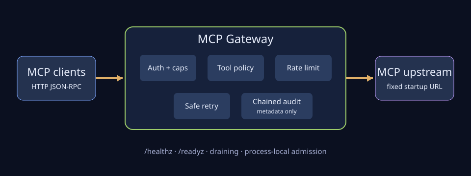

# Architecture

MCP Gateway is one stateless Go HTTP process between MCP clients and one configured HTTP upstream. The process buffers each admitted request and response within configured byte caps, authenticates callers, parses enough JSON-RPC to enforce tool policy, and otherwise preserves permitted end-to-end MCP traffic.

## Request path

1. `/healthz` and `/readyz` are handled locally without credentials or upstream calls.
2. `/mcp` accepts only `POST`; a safe correlation ID is preserved or generated.
3. Authentication compares the presented key against all configured SHA-256 digests in constant time.
4. Process-local admission rejects excess concurrent work before reading the body.
5. The bounded body parser validates the JSON-RPC envelope and authorizes `tools/call` by authenticated client and safe tool name.
6. A fixed-cardinality token bucket applies to each startup-configured allowed client/tool pair.
7. A bounded HTTP transport forwards the exact permitted body and end-to-end headers after removing hop-by-hop headers and the gateway credential.
8. Only explicitly safe read methods with non-null request IDs are eligible for bounded retries.
9. The complete bounded upstream response is validated before headers, status, and bytes are published to the client.
10. One payload-safe, chained audit event is emitted for each handled MCP request after correlation-ID creation.

## State and trust boundaries

Configuration is loaded and validated before the listener starts. Authentication digests, policies, token buckets, admission counters, readiness, and the audit-chain head are process-local. Restarts reset rate limits and begin a new audit segment; replicas do not coordinate. The upstream URL is operator-controlled and fixed at startup. Clients control request bytes, selected end-to-end headers, request IDs, JSON-RPC fields, tool names, and arguments, but cannot allocate new limiter keys.

The container image runs a static binary as numeric UID/GID `65532:65532` from `scratch`. It contains CA certificates for HTTPS upstreams, no shell, and no configuration or credentials. Deployments should add a read-only root filesystem, dropped capabilities, `no-new-privileges`, resource limits, and network policy.

## Shutdown

SIGINT or SIGTERM marks readiness draining before the ten-second shutdown deadline. New MCP work receives bounded `503`; liveness remains available while in-flight requests may complete. If graceful shutdown exceeds the deadline, the process closes the server and exits unsuccessfully.
